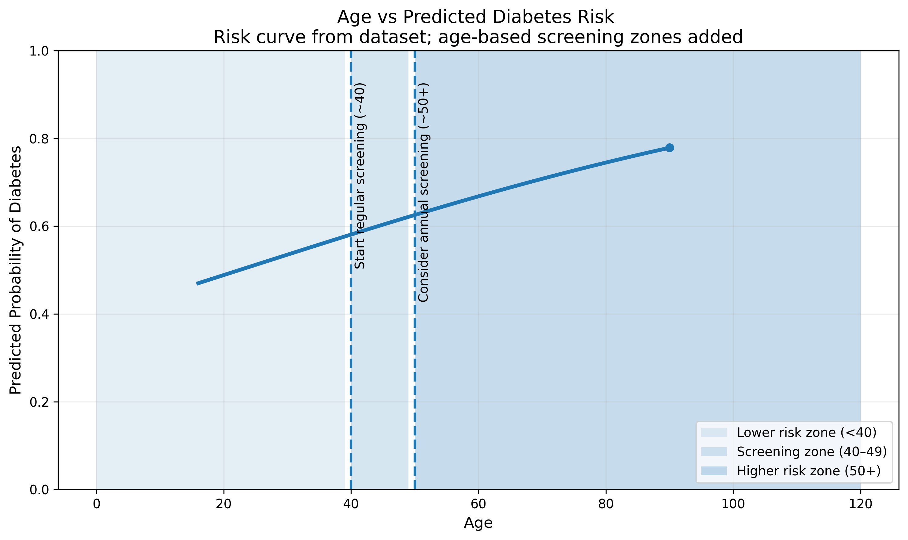
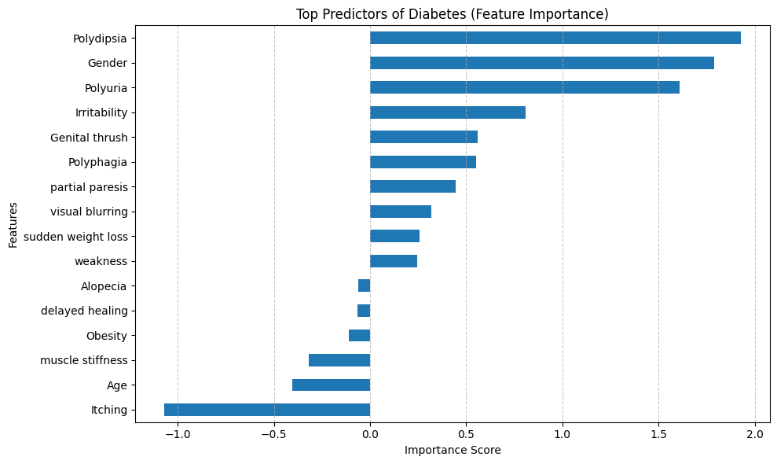
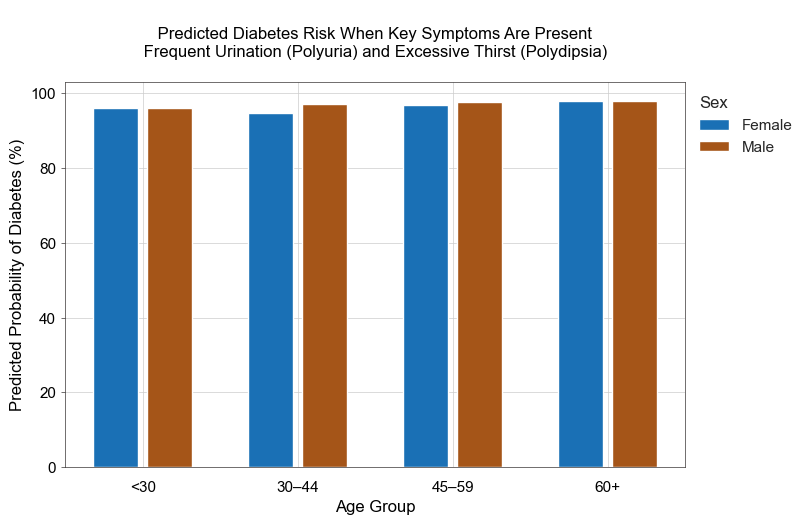

# DS4 - **Group 4 Data Science Project**

## 📑 Table of Contents

- [Purpose & Overview](#purpose--overview)
  - [Research Question](#research-question)
- [Goals & Objectives](#goal--objectives)
  - [Industry Context](#industry-context)
  - [Stakeholders](#stakeholders)
  - [Business Opportunity](#business-opportunity)
- [Techniques & Technologies](#techniques--technologies)
  - [Methodology](#methodology)
- [Key Contacts](#key-contacts-alphabetical-by-first-name)
- [Schedule](#schedule)
- [Limitations & Mitigations Strategies](#limitations)
- [Key Results & Findings](#key-results--findings)
- [Ideas for Future Analysis](#ideas-for-future-analyzes-things-we-would-have-done-if-we-had-more-time)
- [Team Videos](#team-videos)
- [References](#references)

---

## Purpose & Overview

This project focuses on creating data visualization tools that highlight early-stage patterns of diabetes symptoms to support both patient awareness and clinical decision-making. By transforming symptom data into clear, accessible visual insights, the project aims to empower individuals to better recognize potential warning signs and to provide healthcare providers with intuitive tools to illustrate risk patterns during screening conversations.

From a business and industry perspective, this work operates within the preventive healthcare and educational health space, where early detection is linked to improved patient outcomes and reduced long-term costs — a strategic priority for providers, insurers, and public health systems. Visualization-driven tools could enhance patient education and strengthen clinical consultations.

Ultimately, the goal is to bridge the gap between symptom experience and clinical action through data-informed, visually driven communication. By making symptom patterns visible and intuitive, these education tools can support earlier intervention, improve preventive care strategies, and contribute to cost-effective healthcare delivery.

**Dataset Used**:  
https://archive.ics.uci.edu/dataset/529/early+stage+diabetes+risk+prediction+dataset

---

## Research Question

What are the top predictors based on gender and age groups that can identify individuals at high risk of diabetes earlier and enable preventive care?

---

## Goal & Objectives

### Project Goals

1. Increase awareness of early-stage diabetes symptoms through clear and accessible data visualization.  
2. Identify and visually communicate symptom patterns associated with diabetes diagnosis.  
3. Support preventive healthcare efforts by illustrating risk trends relying on predictive modeling.  
4. Bridge the gap between patient-reported symptoms and clinical screening conversations.  
5. Demonstrate the strategic value of data visualization in public health and patient education contexts.

### Project Objectives

1. Clean and transform the Early-Stage Diabetes Risk dataset for visual analysis.  
2. Compare symptom prevalence between diagnosed and non-diagnosed individuals.  
3. Visualize symptom clustering and co-occurrence patterns.  
4. Illustrate the relationship between symptom accumulation and diagnosis rate.  
5. Explore demographic context (e.g., age, obesity) in relation to diagnosis.  
6. Develop clear, interpretable charts that prioritize insight over visual complexity.  
7. Provide evidence-based recommendations for awareness or screening applications.  

---

## Industry Context

This project is situated within the preventive healthcare and public health sector, where early detection of chronic conditions like diabetes remains a critical challenge. Diabetes prevalence continues to rise globally, contributing to significant long-term health complications and healthcare system costs.

Early-stage symptoms are often subtle, misinterpreted, or ignored, leading to delayed diagnosis and preventable disease progression. Leveraging symptom pattern data through clear visual analysis presents an opportunity to improve early awareness and support more timely screening interventions.

---

## Stakeholders

Key stakeholders include:

- Patients  
- Primary care providers  
- Public health organizations  
- Digital health platforms  

Patients benefit from increased awareness of early warning signs that may otherwise be overlooked. Healthcare providers can use symptom pattern insights to inform screening conversations and prioritize testing. Public health agencies may leverage these findings to design targeted education campaigns, while digital health tools could integrate symptom-based insights into screening or triage features.

---

## Business Opportunity

Visualizing symptom patterns associated with diabetes diagnosis creates opportunities to support earlier identification and preventive care. By highlighting high-risk symptom combinations and accumulation trends, healthcare systems and digital platforms could implement structured screening tools or awareness initiatives.

Earlier intervention has the potential to:

- Reduce complications  
- Improve patient outcomes  
- Lower long-term healthcare costs  

---

## 💰 Estimated Economic Value

### Ontario 40+ Prevention Model (Annual)

| Metric | Value |
|------|------|
| Ontario population (40+) | 7,800,000 |
| Program uptake | 20% |
| Participants | 1,560,000 |
| Baseline expected cases | 4,855,839 |
| Cases avoided | 97,117 |
| Baseline healthcare cost | $14,567,517,869 |
| Program cost | $93,600,000 |
| Post-program cost | $14,369,767,512 |
| Gross healthcare savings | $291,350,357 |
| Net savings | $197,750,357 |
| ROI | **2.11x** |

## Techniques & Technologies

### Dataset Used  
https://archive.ics.uci.edu/dataset/529/early+stage+diabetes+risk+prediction+dataset  

Dataset contains **520 records and 16 features**.

### Technical Stack
Programming Language: Python

Libraries Used:
- Numpy: matrix operations
- Pandas: data analysis
- Matplotlib: creating graphs and plots
- Seaborn: enhancing matplotlib plots
- SKLearn: regression analysis

### Methodology

1. **Data Audit**
   - Check for missing values  
   - Duplicate rows  
   - Data types  
   - Impossible values  

2. **Data Cleaning**
   - Standardize categorical variables  
     - Yes → 1  
     - No → 0  
     - Positive diabetes → 1  
     - Negative diabetes → 0  

   - Multicollinearity check  

3. **Exploratory Data Analysis**  
   we explored patterns in the dataset to decide which visuals are most meaningful.
   This includes looking at:

    - distribution of age
    - symptom frequency
    - differences by gender

   This stage helped identify which messages the visuals should communicate. 

4. **Model-based visualization** 
   
   Models were developed, trained and tested. Visuals were created using outputs from predictive models.
     - logistic regression was used to estimate diabetes probability by age

     

     - feature importance visuals from machine learning models ( Random Forest and Logistic Regression)

      

     - risk prediction visuals for screening and prevention use

    **Code reproducibility**
    
    Please run notebook https://github.com/feeza2025/ds4/blob/main/01_activities/dataset_modelling_all.ipynb. 
    
    The notebook is reproducible with np.random.seed(42).

     - Three models were implemented and evaluated. Here is the evaluation result for Log Loss and ROC AUC score. Please note that ROC AUC evaluation was added after the presentation showcase.

        | Metric   | Logistic Regression | Decision Tree Classifier | Random Forest Classifer |
        |----------|---------------------|--------------------------|-------------------------|
        | Log Loss | 0.1535              | 2.4381                   | 0.068                   |
        | ROC AUC  | 0.9906              | 0.9350                   | 0.9988                  |

        Confusion Matrix could also be seen in the notebook

      - The following findings from this analysis were presented in our flyer:
        - list of top 5 symptoms

          Top 5 Symptoms

            - Polydipsia            85.370
            - Polyuria              79.050
            - delayed healing       50.925
            - Obesity               47.975
            - visual blurring       46.460

      
        This chart from the notebook was used in the flyer under the 'Diabetes Risk by Age, Gender & Symptoms' section

        

    
    - Other findings (in the form of bar graphs) and further model analysis (explainability) could also be found in: https://github.com/feeza2025/ds4/blob/main/01_activities/dataset_modelling_all.ipynb
        
5. **Visualization Design**

  Once the patterns were known, we chose the chart type that best fits the message.
   - line graphs for age vs diabetes risk
   - bar graph for comparing gender, age and symptoms
   

6. **Communication**

   After generating the charts, the final step was to decide how to communicate the message to the intended audience. We chose to use flyers as our communication medium.
   For our project, the visuals were meant to support:
   - public awareness
   - prevention messaging
  
---

## Key Contacts (alphabetical by first name)

- Brianna Lowe  
- Cecilia Leung 
- Hema Dawonauth  
- Patricia Rabel  
- Saranjeet Singh  
- Shafeeza Hussain  

---

## Schedule

### Week 1

| Day | Date | Activities |
|----|----|----|
| Day 1 | Feb 24 | Meet team, review dataset, discuss research problem |
| Day 2 | Feb 25 | Review additional datasets and discuss real-world applications |
| Day 3 | Feb 26 | Complete first draft of README, confirm research questions, determine next steps |

### Weekend Work

| Team Members | Activities |
|--------------|------|
| Hema & Shafeeza | Visualization, modeling, and data cleaning |
| Patricia & Brianna | README writing and business case |
| Hema | Financial KPIs development |
| Group | Research healthcare visualizations |
| Group | Review applicability of K-Means clustering |

### Week 2

| Day | Date | Activities |
|----|----|----|
| Day 4 | Mar 3 | Review visualizations created by team members and evaluate simplicity and call-to-action. Review flyer content |
| Day 5 | Mar 4 | Finalize visualizations and update flyer |
| Day 6 | Mar 5 | Prepare PowerPoint presentation, align on final presentation, conduct dry run |
| Day 8 | Mar 7 | Present final project |

---

## Limitations & Mitigation Strategies

| Limitation | Risk | Mitigation |
|------------|------|------------|
| Dataset is from patients in Bangladesh; symptoms may vary by region or population. | Findings may not generalize to Canadian or North American populations. | Frame insights as exploratory and pattern-based rather than universal predictors. Compare findings with Canadian epidemiology literature to validate directional trends. |
| Limited sample size (520 records), especially when segmented by age groups. | Reduced statistical reliability in subgroup analysis. | Use broader age group bins to maintain statistical power. Avoid over-segmentation and clearly label findings as indicative rather than definitive. |
| No data on symptom severity (binary only). | Cannot differentiate between mild vs. clinically significant symptom presentation. | Focus analysis on symptom accumulation and co-occurrence patterns rather than intensity. Highlight this as a future dataset enhancement opportunity. |
| Possible misclassification (negative cases may include prediabetes). | Blurs diagnostic boundary between diabetic and non-diabetic individuals. | Treat the outcome variable as “diagnosed vs. not diagnosed” rather than definitive absence of disease and include a disclaimer in findings. |
| Gender distribution imbalance (328 males – 63%, 192 females – 37%). | Female-based insights may be less statistically stable due to smaller sample size. | Report gender distribution transparently, use proportional comparisons rather than raw counts, and interpret female-specific trends as exploratory. |
---

## Key Results & Findings

**Key results**

1. Random Forest performed much better than Logistic Regression

   Logistic Regression Log Loss: 0.1535

   Random Forest Log Loss: 0.068

   This suggests Random Forest Regression model was far more reliable and better calibrated for predicting diabetes risk on this dataset. Lower log loss is better, so this is a strong result.

2. Age was an important risk factor
   A big part of our project focused on Age vs Predicted Diabetes Risk, and the modeling showed that:

  - diabetes risk tends to increase with age

  - ages 40+ are a meaningful screening group

  - ages 50+ appear to fall into a higher-risk zone in your visual framing

  That makes age a useful variable for public-facing prevention messaging and clinic screening visuals.

3. The project identified symptom-based predictors that are clinically useful
   We explored:

  - symptom frequency

  - feature importance

  - top predictors of diabetes

  From the structure of this diabetes dataset, the project likely showed that a combination of age plus symptom indicators provides strong predictive value. The most useful predictors are the kinds of features that can support early screening and prevention outreach.

4. The dataset is suitable for prevention-oriented risk stratification
   Our analysis direction showed that the dataset can be used to:

  - identify higher-risk adults

  - estimate risk by age group

  - support public awareness campaigns

  - build simple screening visuals for clinics and public healthcare settings

  So the project is not just predictive; it is also actionable for prevention.

---

## Ideas for Future Analyses (things we would have done if we had more time)
- Expand the dataset to include patients from additional geographic regions to assess whether symptom patterns remain consistent across populations.
- Incorporate additional clinical variables (e.g., BMI, blood glucose levels, family history) to improve risk identification.
- Develop an interactive dashboard or Diabetes risk screening tool to help visualize symptom-based risk patterns for patients and clinicians.

---
## Team Videos
Hema Dawonauth - https://www.youtube.com/watch?v=X-gAO3U7kgI

Shafeeza Hussain - https://www.youtube.com/watch?v=68Jf7hUWwjc

Brianna Lowe - https://drive.google.com/file/d/1mI_kAOiKc7KqVXPTPS530ADaupfVytNT/view?usp=sharing

## References

1. https://www.yorku.ca/science/mathstats/acadic/diabetes-in-toronto/  
2. https://www.frontiersin.org/journals/public-health/articles/10.3389/fpubh.2022.1029358/full  
3. https://www.researchgate.net/publication/356828945_Use_of_Machine_Learning_Techniques_to_Predict_Diabetes_at_an_Early_Stage  
4. https://www.ices.on.ca/publications/journal-articles/impact-of-diabetes-on-healthcare-costs-in-a-population-based-cohort-a-cost-analysis  
